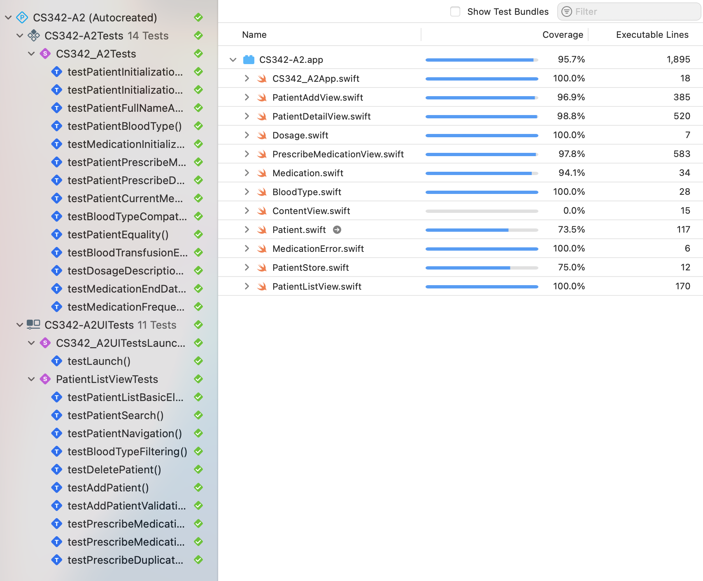

# CS342-A2

This version firstly addresses all code review comments for A1. Thank you and they are exceedingly detailed and helpful on the code level.

- revamps to `Dosage` and `Medication`, `MedicationRoute` types
- `Patient` has been refactored into a Codable class that uses the `Observable` macro
- thorough documentation are generated for all models and views (with the help of AI copilot)
- type content order has been revised
- thorough tests using Swift Testing and XCTest that achieve 96% coverage (with the help of AI copilot)
  - accessibility identifiers on components to achieve this

additional features

- tapping on one of the blood types a patient can receive brings up a `PatientListView` with patients that can act as donors

Coverage:

